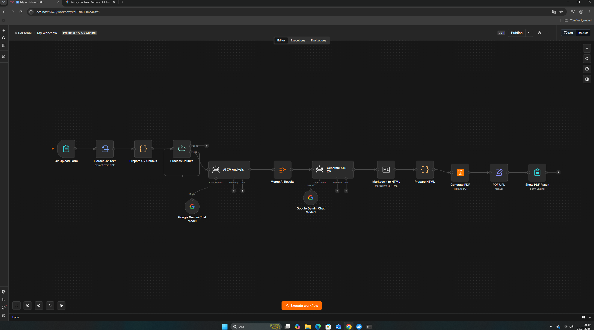

# 🤖 AI CV Generator & ATS Optimizer (n8n Workflow)

Bu proje, yüklenen CV/Özgeçmiş dosyalarını metin parçalarına ayırıp **Google Gemini AI** kullanarak analiz eden ve ATS (Aday Takip Sistemi) uyumlu yeni bir CV PDF'i üreten otomatik bir **n8n** akışıdır.

## 🚀 Özellikler

- **Form İle CV Yükleme:** Kullanıcı dostu arayüz üzerinden PDF CV kabulü.
- **Metin Çıkarma ve Parçalama (Chunking):** PDF içerisindeki metinlerin işlenebilir parçalara bölünmesi.
- **Gemini AI Analizi:** Özgeçmişin güçlü ve zayıf yönlerinin yapay zeka ile analizi.
- **ATS Formatına Dönüştürme:** CV içeriğinin ATS yazılımlarına en uygun biçimde yapılandırılması.
- **HTML to PDF Render:** Hazırlanan içeriğin HTML'e, ardından indirilebilir PDF formatına dönüştürülmesi.

## 🛠️ Kurulum ve İçe Aktarma

1. Bu depodaki `workflow.json` dosyasını bilgisayarınıza indirin.
2. n8n panelinizde sağ üstteki menüden **Import from File** seçeneğini kullanarak dosyayı yükleyin.
3. Gerekli servis bağlantılarını (Credentials) tanımlayın:
   - **Google Gemini API Key:** [Google AI Studio](https://aistudio.google.com/) üzerinden alacağınız API anahtarı.
4. Workflow'u aktifleştirin (Publish).
